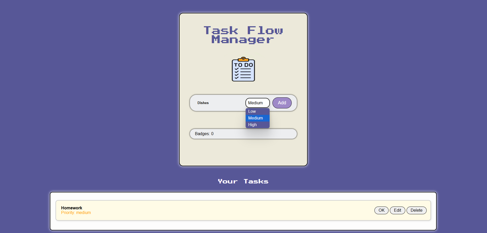

Task-Flow Manager
This application has been designed to assist people with organizing and managing their tasks. It allows users to set the priority level of their tasks and upon completion will be rewarded with points to be competed against users on daily leaderboards.
 
 Code Language
 Front-End is developed utilizing HTML, CSS, and JavaScript. 
 Back-End is developed utilizing Java.

 Instructions to run the Web application in GitHub Codespaces or Visual Studio Code on MacOS
 
 1. Change directory into the root folder by running the following command in the correct directory: cd task-flow-manager
 2. Ensure Node Package Manager (npm) is installed by running the command: npm -version
 3. If the npm command is not found, install nodejs at http://nodejs.org
 4. Install dependencies listed in package.json using NPM by running the following command: npm install
 5. To run the Web application, use the following command: node_modules/http-server/bin/http-server
 6. Start the server in the terminal: npm run start:api
 7. Should show Index http://localhost:3000/ Static files: Serving ./public directory if it exists Endpoints: http://localhost:3000/tasks http://localhost:3000/users We have 2 end points listed users and task
 8. Go to the Web browser and enter: http://127.0.0.1:8080/src/
 
 Usage
 The application can be used for general task management activities like create, edit, or delete tasks. 

 

 Future Developments
 We plan on developing this application to support a group,  primarily targeting. project managers, teachers and parents to assign tasks to their members and improve accountability. 

